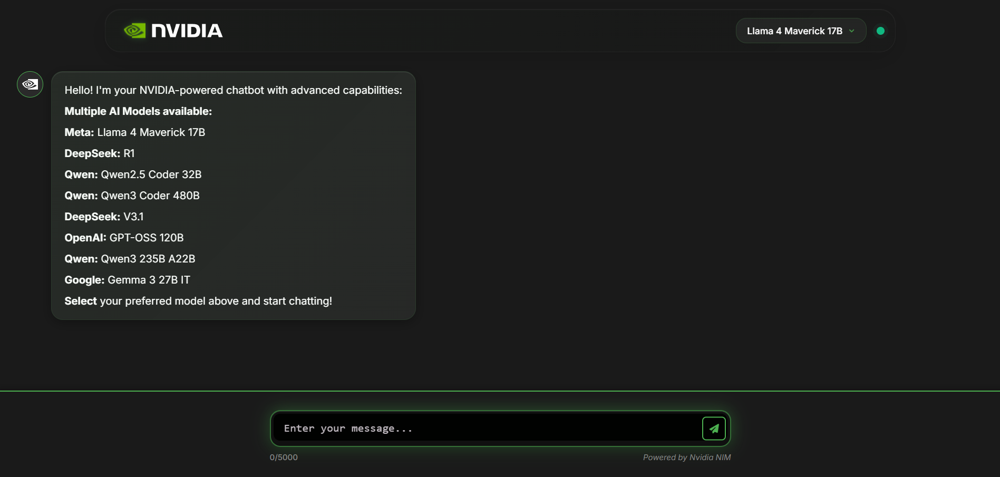

# NVIDIA NIM Chatbot 🤖

An intelligent, multi-model chatbot backend powered by **NVIDIA NIM** and **OpenRouter**.  
This app brings cutting-edge AI models into a simple API you can integrate with any frontend.

---

## ✨ Highlights
- 🚀 **Fast & Secure** Flask backend deployed on Render
- 🧠 **Multi-model support** with NVIDIA and OpenRouter APIs
- 🔌 **Simple REST endpoints** for easy integration
- 📡 **Production-ready** with Gunicorn
- 🛡️ CORS-enabled for seamless frontend usage

---

## 🧑‍💻 Available Models
Our chatbot supports multiple state-of-the-art LLMs:
- **Meta LLaMA 4 Maverick 17B**
- **DeepSeek R1 & V3.1**
- **Qwen 2.5 & 3 series**
- **Google Gemma 3 27B**
- **OpenAI GPT OSS 120B**

More models can be added easily!

---

## 🖼️ Screenshot

---

## 🌍 Deployment
The backend is live on **Render** and ready to serve requests via its `/api/chat` endpoint.

---

## 🙌 Acknowledgements
Built with ❤️ using:
- [Flask](https://flask.palletsprojects.com/)
- [Gunicorn](https://gunicorn.org/)
- [Render](https://render.com/)
- [NVIDIA API](https://developer.nvidia.com/)
- [OpenRouter](https://openrouter.ai/)
